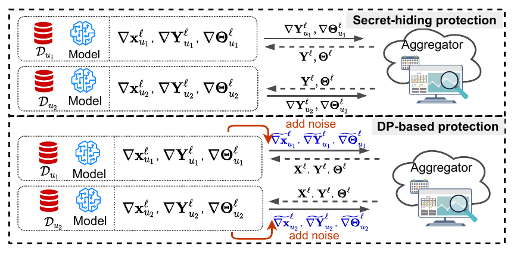
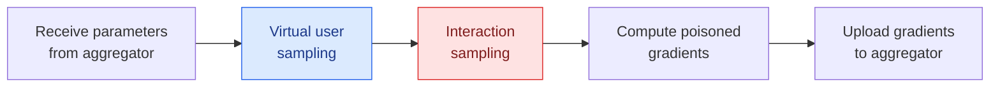
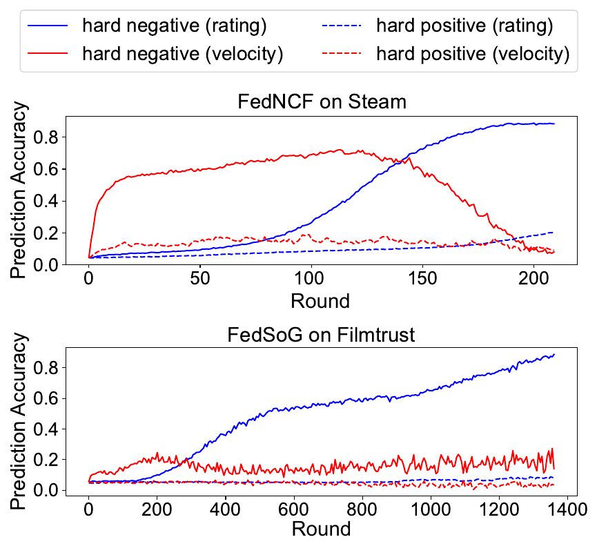
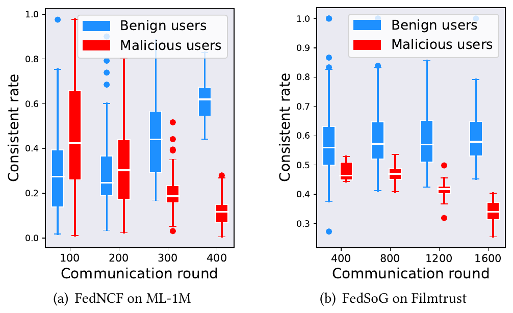
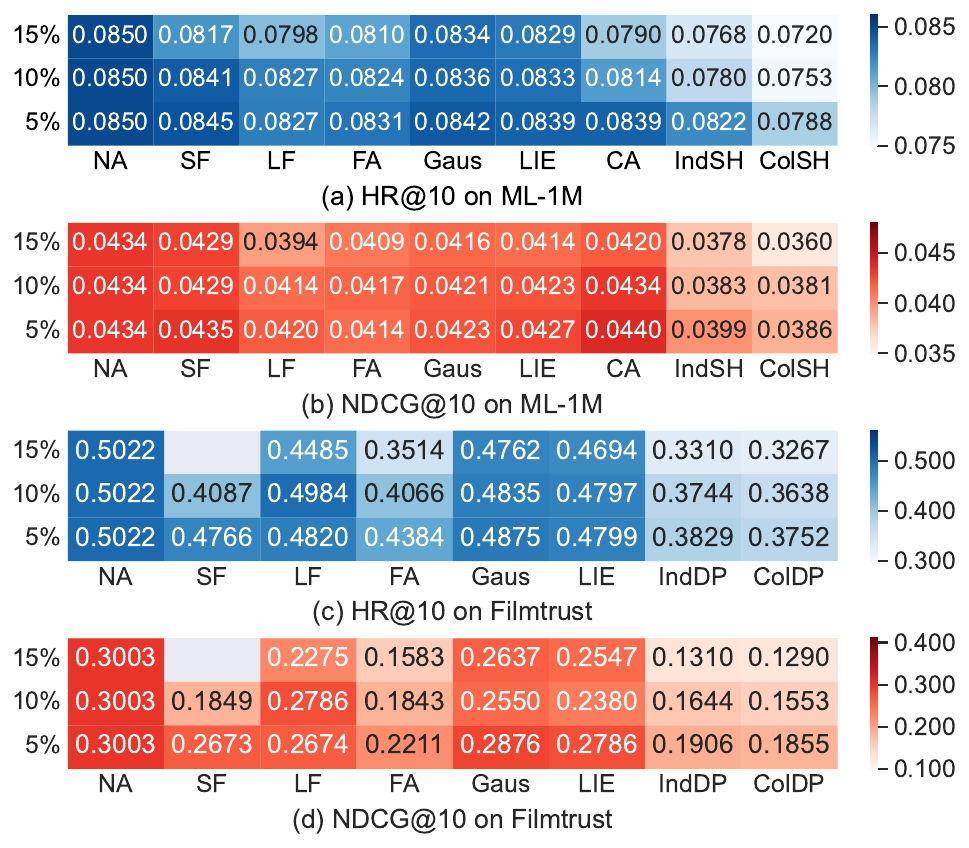
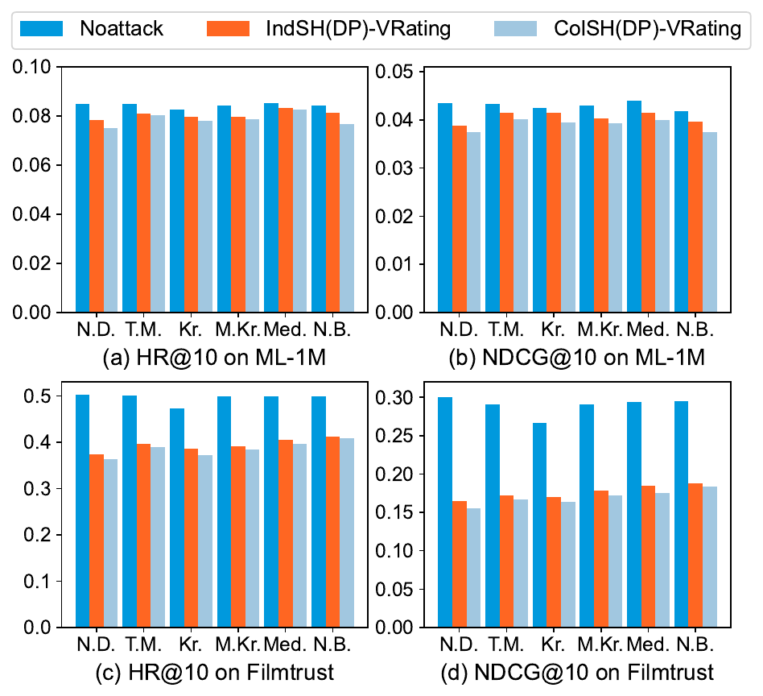

<div align="center">

<h1>Not One Less</h1>

<h3>Exploring Interplay between User Profiles and Items in<br>Untargeted Attacks against Federated Recommendation</h3>

Yurong Hao · Xihui Chen · Xiaoting Lyu · Jiqiang Liu · Yongsheng Zhu · Zhiguo Wan · Sjouke Mauw · Wei Wang

*ACM Conference on Computer and Communications Security (CCS) 2024*

[](https://doi.org/10.1145/3658644.3670365)
[](https://doi.org/10.1145/3658644.3670365)
[](https://doi.org/10.1145/3658644.3670365)
[](https://www.python.org/)
[](https://pytorch.org/)

[**Overview**](#-overview) ·
[**Method**](#-method) ·
[**Results**](#-results) ·
[**Preparation**](#%EF%B8%8F-preparation) ·
[**Getting Started**](#-getting-started) ·
[**Run Experiment**](#-run-experiment) ·
[**Citation**](#-citation)

</div>

<br>

This project contains the source codes of the proposed approach and experiments for the paper *Not One Less: Exploring Interplay between User Profiles and Items in Untargeted Attacks against Federated Recommendation*, accepted by ACM CCS 2024. It includes the untargeted attack **FRecAttack²** and the defence **GuardCQ**.

## 📖 Overview

Federated recommendation (FR) trains personalised recommender systems without collecting users' data, but it remains vulnerable to poisoning attacks. This work focuses on **untargeted poisoning attacks**, which degrade the overall performance of the recommender service. The paper proposes a general framework to formalise untargeted attacks against FR and identifies the vital role played by the **interplay between items and user profiles** in determining FR's performance.

> [!NOTE]
> **Main contributions**
> - **A general framework** that formalises untargeted attacks against both *secret-hiding* and *DP-based* FR models.
> - **FRecAttack²**, an untargeted attack that exploits the interplay between user profiles and items through two building blocks: *virtual user sampling* and *interaction sampling*. It outperforms existing methods by up to **27.56%** and evades mainstream defences.
> - **GuardCQ**, a defence that detects malicious users by quantifying their contributions to the right interplay between items and user profiles.

FR models are classified into two types according to how users' privacy is protected. In **secret-hiding** models, user embeddings are kept locally on each client. In **DP-based** models, all model parameters, including user embeddings, are shared after being perturbed with noise satisfying differential privacy.

<p align="center">
  
  <br>
  <sub><b>Figure 1.</b> User privacy protection in FR.</sub>
</p>

According to the type of FR and whether malicious users collude, four attack scenarios are considered:

<div align="center">

| Attack type | Independent attack | Secret-hiding FR | DP-based FR |
|:---:|:---:|:---:|:---:|
| **IndSH** | ✅ | ✅ | |
| **ColSH** | ❌ | ✅ | |
| **IndDP** | ✅ | | ✅ |
| **ColDP** | ❌ | | ✅ |

</div>

## 🧠 Method

In each round, a malicious user receives the parameters from the aggregator, samples a set of virtual users to approximate the distribution of benign users, samples the hardest positive and negative interactions for these virtual users, and uploads the gradients computed from the manipulated interactions.



### 🔵 Virtual user sampling

<div align="center">

| Scenario | Sampling method |
|:---:|:---|
| **IndSH** | Draw *n* samples from a normal distribution centred at the malicious user's own embedding, with variance σ². |
| **ColSH** | Malicious users share their embeddings through the attacker, cluster them with *k*-means, and sample from a normal distribution for each cluster. The number of samples is proportional to the cluster size. |
| **IndDP** | Cluster the noisy user embeddings shared in the DP-based system and sample from a normal distribution for each cluster. |
| **ColDP** | Cluster the noisy user embeddings, assign each malicious user to the closest cluster centre, and re-calculate the distribution of each cluster with the malicious users' true embeddings. |

</div>

### 🔴 Interaction sampling

Existing attacks select hard samples based only on absolute recommendation scores. As shown in Figure 2, this is accurate in the late stage of training but performs poorly in the early stage. Selecting hard samples by the **change velocity** of recommendation scores gives much higher accuracy in the early stage, but its accuracy drops in the late stage.

<p align="center">
  
  <br>
  <sub><b>Figure 2.</b> Hard item sampling with recommendation ratings (blue) and their change velocities (red).</sub>
</p>

FRecAttack² therefore combines the two measurements. It starts with velocity-based sampling and switches to rating-based sampling when the hard items shared between consecutive rounds increase in less than half of the last *M* rounds.

### 🛡️ GuardCQ defence

GuardCQ defines the "right interplay" as rating behaviours consistent with the global model on popular items. Popular items are inferred in three ways: by absolute scores, by velocity, and by counting the interactions reported by users. As training progresses, the consistency of benign users approaches 1.0 while that of malicious users approaches zero.

<p align="center">
  
  <br>
  <sub><b>Figure 3.</b> Rating behaviour of benign users and malicious users in different rounds of model training.</sub>
</p>

In each round, GuardCQ sorts users' contributions and takes the maximum gap between adjacent values as the threshold. A user is labelled as malicious only when identified as such under all three popular item sets. GuardCQ can also be combined with existing Byzantine-robust FL methods.

## 📊 Results

All results below are taken from the paper, with 10% malicious users. Values are HR@10, and the degrading ratio relative to No Attack is shown in parentheses.

### Attack performance with no defences

<div align="center">

| Dataset | Model | No Attack | FedAttack | FRecAttack²-Ind | FRecAttack²-Col |
|:---|:---|:---:|:---:|:---:|:---:|
| ML-1M | FedNCF | 0.0850 | 0.0824 (3.06%) | 0.0780 (8.24%) | **0.0753 (11.41%)** |
| ML-1M | FedMLP | 0.0838 | 0.0803 (4.18%) | 0.0793 (5.37%) | **0.0746 (10.98%)** |
| Steam | FedNCF | 0.1903 | 0.1853 (2.63%) | 0.1736 (8.78%) | **0.1660 (12.77%)** |
| Steam | FedMLP | 0.1783 | 0.1738 (2.52%) | 0.1728 (3.08%) | **0.1529 (14.25%)** |
| Lastfm | FedSoG | 0.0288 | 0.0233 (19.10%) | 0.0221 (23.26%) | **0.0212 (26.39%)** |
| Lastfm | FedGNN | 0.0235 | 0.0207 (11.91%) | 0.0185 (21.27%) | **0.0176 (25.11%)** |
| Filmtrust | FedSoG | 0.5022 | 0.4066 (19.11%) | 0.3744 (25.45%) | **0.3638 (27.56%)** |
| Filmtrust | FedGNN | 0.5276 | 0.4376 (17.05%) | 0.3895 (26.18%) | **0.3890 (26.27%)** |

<sub>FRecAttack²-Ind denotes IndSH on ML-1M and Steam, and IndDP on Lastfm and Filmtrust. FRecAttack²-Col is defined similarly. Results of the other baselines (SignFlip, LabelFlip, Gaussian, LIE, ClusterAttack) and NDCG@10 are given in Table 3 of the paper.</sub>

</div>

### Defence performance of GuardCQ on Filmtrust

<div align="center">

| Attack | NoDefense | GuardCQ | GuardCQ + N.B. | GuardCQ + T.M. |
|:---|:---:|:---:|:---:|:---:|
| NoAttack | 0.5022 | 0.4987 | – | – |
| FRecAttack²-IndDP | 0.3744 | 0.4706 | 0.4865 | **0.4952** |
| FRecAttack²-ColDP | 0.3638 | 0.4581 | 0.4875 | **0.4949** |

<sub>N.B.: NormBound, T.M.: Trimmed-mean.</sub>

</div>

### Malicious user proportion and mainstream defences

<table>
  <tr>
    <td align="center" width="50%"></td>
    <td align="center" width="50%"></td>
  </tr>
  <tr>
    <td align="center"><sub><b>Figure 4.</b> Attack performance with 5%, 10% and 15% malicious users. A lighter colour indicates a better degrading performance.<br>NA: No Attack, SF: SignFlip, LF: LabelFlip, FA: FedAttack, Gaus: Gaussian, CA: ClusterAttack.</sub></td>
    <td align="center"><sub><b>Figure 5.</b> Attack performance under mainstream defences.<br>N.D.: no defence, T.M.: Trimmed-mean, Kr.: Krum, M.Kr.: Multi-krum, Med.: Median, N.B.: NormBound.</sub></td>
  </tr>
</table>

## 🛠️ Preparation

### Virtual Environment Creation

The project is coded with Python 3.8 and PyTorch 1.12.0. The following shell commands are used to create the virtual environment with **Anaconda**.

```shell
conda create -n FR python=3.8
conda activate FR
conda install pytorch==1.12.0 torchvision==0.13.0 torchaudio==0.12.0 cudatoolkit=11.6 -c pytorch   # 3–5 minutes
```

### Package and Library Installation

The following commands are used to install the required packages and libraries in the virtual environment **FR** to accelerate the speed of data processing and analysis.

```shell
pip install -r requirements.txt                                                                  # ~25 minutes
conda install -c rapidsai -c numba -c nvidia -c conda-forge cudf=23.04 cuml=23.04               # ~40 minutes
```

### Datasets

ML-1M and Steam are used for secret-hiding models, and Lastfm and Filmtrust are used for DP-based models.

<div align="center">

| Dataset | #Users | #Items | #Ratings | #Social Connection |
|:---|:---:|:---:|:---:|:---:|
| ML-1M | 6,040 | 3,706 | 1,000,209 | – |
| Steam | 3,753 | 5,134 | 114,713 | – |
| Lastfm | 1,892 | 17,632 | 92,834 | 5,676 |
| Filmtrust | 874 | 1,957 | 18,662 | 1,853 |

</div>

## 🚀 Getting Started

### File Tree

```text
FRecAttack2/
├── Data/                 # datasets used in the experiment
├── dataloader.py         # responsible for loading data
├── main.py               # the main script
├── server.py             # the operations performed by the aggregator
├── client.py             # the local operations performed by benign users
├── attack.py             # the local operations performed by malicious users
├── col_server.py         # the operations performed by malicious users when they collude
├── defense.py            # the operations performed by the aggregator when deploying GuardCQ
├── model.py              # the base recommender models: FedNCF, FedMLP, FedSoG, FedGNN
├── GAT.py                # sub-modules of FedSoG and FedGNN
├── filename_gen.py       # generates filenames for experiment results
├── parse.py              # lists the parameters used in the codes
├── utils.py              # experimental metrics, e.g., HR and NDCG
├── run_attack.sh         # shell commands for the attack experiments
├── run_defense.sh        # shell commands for the defence experiments
└── results_analysis.py   # generates the experimental results
```

### Example

Here is an example command to run the attack with Col-SH on the MovieLens (ML-1M) dataset with FedNCF:

```shell
python main.py --select_model FedNCF --data ML_1M --lr 0.005 --epoch 2500 --mali_ratio 0.1 \
    --attack_user ColSH --attack_item RatingOfChange --sample_size 100 --alpha 0.1 \
    --agg avg --show_mode print &
```

<details>
<summary>The output similar to the following will be shown in the terminal (click to expand).</summary>

```text
Arguments: show_mode=print,select_model=FedNCF,data=ML_1M,device=cuda,layers=[64, 32, 16, 8],batch_size=16,embedding_dim=16,lr=0.005,epoch=2500,frac=0.1,num_neg=1,seed=608,top_k=[10,20],agg=avg,valid_step=1,mali_ratio=0.1,attack_user=ColSH,Noisy_pat=ColDP,attack_item=RatingOfChange,sample_size=100,alpha=0.1,sigma=0.1,window_size=2,is_detect=1,start_detect=1,wind_sz=50,clip=0.1,laplace_lambda=0.1,loss=mae,weight_decay=0.001,head_num=1
Using backend: pytorch
Iteration 0, loss = 0.68924, HR@10 = 0.00258, nDCG@10 = 0.00102
Iteration 1, loss = 0.69012, HR@10 = 0.00276, nDCG@10 = 0.00108
Iteration 2, loss = 0.68959, HR@10 = 0.00331, nDCG@10 = 0.00122
Iteration 3, loss = 0.68903, HR@10 = 0.00368, nDCG@10 = 0.00140
Iteration 4, loss = 0.68851, HR@10 = 0.00350, nDCG@10 = 0.00140
...
```

</details>

### Attack Scenarios

The attack scenarios are selected with the following arguments. See `run_attack.sh` and `run_defense.sh` for complete commands.

<div align="center">

| Scenario | Model | Arguments |
|:---|:---|:---|
| No attack | Any | `--mali_ratio 0.0 --attack_user NoAttack` |
| IndSH | FedNCF, FedMLP | `--attack_user IndSH` |
| ColSH | FedNCF, FedMLP | `--attack_user ColSH` |
| IndDP | FedSoG, FedGNN | `--attack_user Noisy_Col --Noisy_pat IndDP` |
| ColDP | FedSoG, FedGNN | `--attack_user Noisy_Col --Noisy_pat ColDP` |
| Without GuardCQ | Any | `--is_detect 0` |
| With GuardCQ | Any | `--is_detect 1 --start_detect <round>` |

</div>

## 🔬 Run Experiment

If you wish to obtain comprehensive results and analysis for our attacks and defence, run:

```shell
CUDA_VISIBLE_DEVICES=0 nohup bash run_attack.sh &
CUDA_VISIBLE_DEVICES=0 nohup bash run_defense.sh &
```

Once started, it will automatically create a directory called `results` and other sub-directories according to the command line. The files storing the results are named in a unified format:

```text
{attack method}-{the ratio of malicious user}-{defense method}-{random seed}.txt
```

Running `results_analysis.py` will provide you with the main results related to both the attack and defence:

```shell
python results_analysis.py
```

> [!TIP]
> If there are multiple GPUs available, you can modify `CUDA_VISIBLE_DEVICES=0` (e.g., `CUDA_VISIBLE_DEVICES=1`) to reduce the running time.

> [!IMPORTANT]
> Please note that the optimal hyperparameters may vary across different datasets or models.

## 📝 Citation

Consider citing the paper if you use the codes in your papers, as follows:

```bibtex
@inproceedings{hao2024notoneless,
  title     = {Not One Less: Exploring Interplay between User Profiles and Items in Untargeted Attacks against Federated Recommendation},
  author    = {Hao, Yurong and Chen, Xihui and Lyu, Xiaoting and Liu, Jiqiang and Zhu, Yongsheng and Wan, Zhiguo and Mauw, Sjouke and Wang, Wei},
  booktitle = {Proceedings of the 2024 ACM SIGSAC Conference on Computer and Communications Security (CCS '24)},
  pages     = {2889--2903},
  year      = {2024},
  publisher = {ACM},
  doi       = {10.1145/3658644.3670365}
}
```

## 📄 License

The project is for learning and research purposes only.
