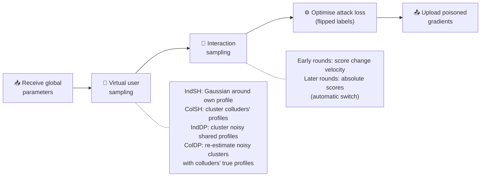
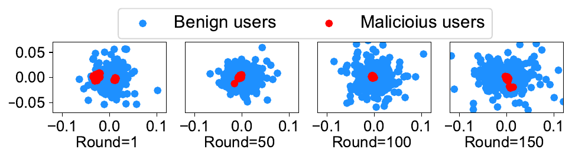
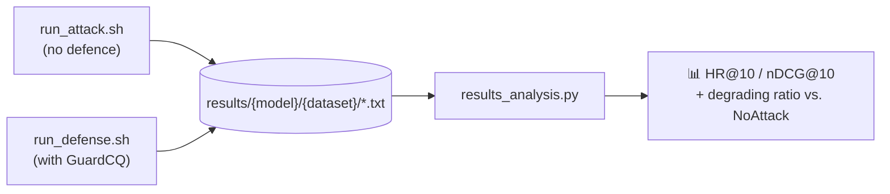

<div align="center">

# FRecAttack² & GuardCQ

### Not One Less: Exploring Interplay between User Profiles and Items in Untargeted Attacks against Federated Recommendation

**Yurong Hao, Xihui Chen, Xiaoting Lyu, Jiqiang Liu, Yongsheng Zhu, Zhiguo Wan, Sjouke Mauw, Wei Wang**

*ACM SIGSAC Conference on Computer and Communications Security (CCS 2024)*

[](https://doi.org/10.1145/3658644.3670365)
[](https://www.sigsac.org/ccs/CCS2024/)
[](https://doi.org/10.1145/3658644.3670365)
[](https://doi.org/10.1145/3658644.3670365)
<br>
[](https://www.python.org/)
[](https://pytorch.org/)
[](https://developer.nvidia.com/cuda-toolkit)

[Overview](#-overview) •
[Method](#-method) •
[Results](#-results) •
[Installation](#%EF%B8%8F-installation) •
[Quick Start](#-quick-start) •
[Reproduce](#-reproducing-the-experiments) •
[Citation](#-citation)

</div>

---

This repository is the official implementation of **FRecAttack²**, an untargeted poisoning attack against federated recommendation (FR), and **GuardCQ**, a defence that detects malicious users by quantifying their contributions. Both are presented in our CCS 2024 paper.

## 🔥 Highlights

- **A general framework for untargeted attacks on FR.** It covers both *secret-hiding* FR (user embeddings never leave the device) and *DP-based* FR (noisy user embeddings are shared), and identifies the **interplay between user profiles and items** as the key factor behind attack performance.
- **FRecAttack²**, built on two components: **virtual user sampling** to approximate the distribution of benign users, with or without collusion among malicious users, and **velocity-based interaction sampling** to find the items that disrupt the right user–item interplay early in training.
- **Stronger and stealthier.** FRecAttack² outperforms existing untargeted attacks by up to **27.56%** and remains effective under mainstream Byzantine-robust defences.
- **GuardCQ**, a defence that reduces the damage of FRecAttack²-ColDP on Filmtrust from **27.56% to 8.78%**, and to **3.29%** when combined with NormBound.

## 📖 Overview

In FR, an aggregator coordinates training while users keep their interaction data locally. Depending on how user profiles are protected, FR systems fall into two families:

<p align="center">
  
  <br>
  <em>User privacy protection in FR. Top: secret-hiding models only share item embeddings and model parameters. Bottom: DP-based models share all parameters, perturbed with noise.</em>
</p>

Existing untargeted attacks (e.g., FedAttack, ClusterAttack) mainly manipulate item embeddings based on the malicious users' own profiles. This ignores the fact that what determines recommendation quality is how items interact with the profiles of **general** users. FRecAttack² targets exactly this interplay.

We consider four attack scenarios, depending on the FR type and whether malicious users can collude through the attacker:

| Scenario | Colluding? | Victim FR type | Victim models in this repo |
|---|:---:|---|---|
| **IndSH** | ✗ | Secret-hiding | FedNCF, FedMLP |
| **ColSH** | ✓ | Secret-hiding | FedNCF, FedMLP |
| **IndDP** | ✗ | DP-based | FedGNN, FedSoG |
| **ColDP** | ✓ | DP-based | FedGNN, FedSoG |

## 🧠 Method

In every round, each malicious user runs the following pipeline before uploading its poisoned update:



### 1. Virtual user sampling

Instead of treating the malicious users themselves as representatives of all users, each malicious user samples a set of **virtual user embeddings** that approximate the distribution of benign users. In the independent scenarios, samples are drawn around the malicious user's own profile (IndSH) or from clusters of the noisy shared profiles (IndDP). With collusion, malicious users share their true embeddings through the attacker, cluster them with *k*-means, and draw samples from each cluster in proportion to its size (ColSH, ColDP).

### 2. Velocity-based interaction sampling

For the sampled users, the attack looks for the hardest positive and negative items and flips their labels. We found that ranking items by their **absolute recommendation scores**, as done in prior work, is only accurate in the late stage of training. Ranking them by the **velocity** at which their scores change is much more accurate early on:

<p align="center">
  
  <br>
  <em>Prediction accuracy of hard items using recommendation ratings (blue) vs. their change velocities (red).</em>
</p>

FRecAttack² therefore starts with velocity-based sampling and automatically switches to rating-based sampling once the velocity-based predictions stop stabilising across consecutive rounds.

### 3. GuardCQ defence

GuardCQ tracks, over a sliding window of rounds, how consistent each user's rating behaviour on **popular items** is with the global model. Popular items are inferred in three ways: by absolute scores, by score velocities, and by interaction frequency. Benign users become increasingly consistent as training goes on, while malicious users drift the other way:

<p align="center">
  
  <br>
  <em>Consistency of rating behaviour on popular items for benign (blue) and malicious (red) users.</em>
</p>

In each round, GuardCQ sorts users by their contribution scores and uses the largest gap to separate them. A user is flagged as malicious only if all three popular-item views agree. GuardCQ needs no extra information beyond what the FR system already collects, and it can be combined with existing Byzantine-robust aggregators.

## 📊 Results

**Degradation of HR@10 with 10% malicious users and no defence** (higher = stronger attack). The baseline column shows the best of SignFlip, LabelFlip, FedAttack, Gaussian, LIE and ClusterAttack.

| Dataset | Model | Best baseline | FRecAttack² (Ind) | FRecAttack² (Col) |
|---|---|:---:|:---:|:---:|
| ML-1M | FedNCF | 4.24% | 8.24% | **11.41%** |
| ML-1M | FedMLP | 4.18% | 5.37% | **10.98%** |
| Steam | FedNCF | 5.20% | 8.78% | **12.77%** |
| Steam | FedMLP | 2.80% | 3.08% | **14.25%** |
| Lastfm | FedSoG | 19.10% | 23.26% | **26.39%** |
| Lastfm | FedGNN | 11.91% | 21.27% | **25.11%** |
| Filmtrust | FedSoG | 19.11% | 25.45% | **27.56%** |
| Filmtrust | FedGNN | 17.05% | 26.18% | **26.27%** |

**GuardCQ on Filmtrust (FedSoG, HR@10).**

| Attack | No defence | GuardCQ | GuardCQ + NormBound |
|---|:---:|:---:|:---:|
| No attack | 0.5022 | 0.4987 | – |
| FRecAttack²-IndDP | 0.3744 | 0.4706 | 0.4865 |
| FRecAttack²-ColDP | 0.3638 | 0.4581 | 0.4875 |

<details>
<summary>📈 More figures (click to expand)</summary>

<br>

**Impact of the proportion of malicious users (5%, 10%, 15%).** Lighter colours mean stronger attacks.

<p align="center"></p>

**FRecAttack² under mainstream defences** (N.D.: no defence, T.M.: Trimmed-mean, Kr.: Krum, M.Kr.: Multi-Krum, Med.: Median, N.B.: NormBound).

<p align="center"></p>

**PCA of model gradients (FedNCF on ML-1M).** Malicious gradients are hidden among benign ones, which is why gradient-based detection struggles.

<p align="center"></p>

</details>

See the [paper](https://doi.org/10.1145/3658644.3670365) for full results, including NDCG@10 and the ablation study.

## 🛠️ Installation

The code is tested with **Python 3.8**, **PyTorch 1.12.0** and **CUDA 11.6** on Ubuntu. The experiments in the paper were run on NVIDIA RTX 4090 GPUs.

**1. Create the conda environment** (about 3–5 minutes)

```bash
conda create -n FR python=3.8 -y
conda activate FR
conda install pytorch==1.12.0 torchvision==0.13.0 torchaudio==0.12.0 cudatoolkit=11.6 -c pytorch
```

**2. Install dependencies** (about 25 minutes)

```bash
pip install -r requirements.txt
```

**3. Install RAPIDS cuDF / cuML** for GPU-accelerated clustering (about 40 minutes)

```bash
conda install -c rapidsai -c numba -c nvidia -c conda-forge cudf=23.04 cuml=23.04
```

## 📦 Datasets

| Dataset | Domain | #Users | #Items | #Ratings | Used for | In repo |
|---|---|---:|---:|---:|---|:---:|
| [MovieLens-1M](https://grouplens.org/datasets/movielens/1m/) | Movies | 6,040 | 3,706 | 1,000,209 | Secret-hiding | ✅ `Data/ML_1M/` |
| Steam-200K | Games | 3,753 | 5,134 | 114,713 | Secret-hiding | ✅ `Data/Steam/` |
| Filmtrust | Movies + social | 874 | 1,957 | 18,662 | DP-based | ✅ `Data/filmtrust.pkl` |
| Lastfm | Music + social | 1,892 | 17,632 | 92,834 | DP-based | ❌ |

> The DP-based models (FedGNN, FedSoG) also use the social connections in Filmtrust and Lastfm. Lastfm is not bundled with this repository.

## 🚀 Quick Start

Run **FRecAttack²-ColSH** against **FedNCF** on **ML-1M** with 10% malicious users and print logs to the terminal:

```bash
python main.py \
    --select_model FedNCF --data ML_1M \
    --lr 0.005 --epoch 2500 \
    --mali_ratio 0.1 --attack_user ColSH --attack_item RatingOfChange \
    --sample_size 100 --alpha 0.1 \
    --agg avg --is_detect 0 --show_mode print
```

<details>
<summary>📋 Expected output (click to expand)</summary>

```text
Arguments: show_mode=print,select_model=FedNCF,data=ML_1M,device=cuda,layers=[64, 32, 16, 8],batch_size=16,embedding_dim=16,lr=0.005,epoch=2500,frac=0.1,num_neg=1,seed=608,top_k=[10,20],agg=avg,valid_step=1,mali_ratio=0.1,attack_user=ColSH,Noisy_pat=ColDP,attack_item=RatingOfChange,sample_size=100,alpha=0.1,sigma=0.1,window_size=2,is_detect=0,start_detect=1,wind_sz=50,clip=0.1,laplace_lambda=0.1,loss=mae,weight_decay=0.001,head_num=1
Using backend: pytorch
Iteration 0, loss = 0.68924, HR@10 = 0.00258, nDCG@10 = 0.00102
Iteration 1, loss = 0.69012, HR@10 = 0.00276, nDCG@10 = 0.00108
Iteration 2, loss = 0.68959, HR@10 = 0.00331, nDCG@10 = 0.00122
...
```

</details>

**How to select each scenario:**

| Scenario | Model | Flags |
|---|---|---|
| No attack | any | `--mali_ratio 0.0 --attack_user NoAttack` |
| IndSH | FedNCF / FedMLP | `--attack_user IndSH` |
| ColSH | FedNCF / FedMLP | `--attack_user ColSH` |
| IndDP | FedSoG / FedGNN | `--attack_user Noisy_Col --Noisy_pat IndDP` |
| ColDP | FedSoG / FedGNN | `--attack_user Noisy_Col --Noisy_pat ColDP` |
| + GuardCQ | any | `--is_detect 1 --start_detect 50` |

For example, FRecAttack²-ColDP against FedSoG on Filmtrust with GuardCQ enabled:

```bash
python main.py --select_model FedSoG --data filmtrust --lr 0.1 --epoch 1455 \
    --mali_ratio 0.1 --attack_user Noisy_Col --Noisy_pat ColDP --attack_item RatingOfChange \
    --sample_size 50 --alpha 0.1 --window_size 2 \
    --agg avg --is_detect 1 --start_detect 100 --show_mode print
```

## 🔬 Reproducing the Experiments



**Step 1. Attacks without defence**

```bash
CUDA_VISIBLE_DEVICES=0 nohup bash run_attack.sh &
```

**Step 2. Attacks with GuardCQ**

```bash
CUDA_VISIBLE_DEVICES=0 nohup bash run_defense.sh &
```

> 💡 With multiple GPUs, set a different `CUDA_VISIBLE_DEVICES` for each script to run them in parallel.

Logs are saved to `results/{model}/{dataset}/` with the following naming scheme:

```text
{attack}-mr{malicious ratio}-{agg | GuardCQ_agg}-seed{seed}.txt
# e.g.  ColSH-mr0.1-avg-seed608.txt
#       ColSH-mr0.1-GuardCQ_avg-seed608.txt
```

**Step 3. Summarise the results**

```bash
python results_analysis.py
```

For every result directory, the script averages HR@10 and nDCG@10 over the final rounds and reports the **degrading ratio** relative to the `NoAttack` run, i.e. $(\delta - \delta_{atk}) / \delta$. Without defence, a higher ratio means a stronger attack. With GuardCQ, a lower ratio means a more effective defence.

> ⚠️ Optimal hyperparameters vary across datasets and models. See `run_attack.sh` and `run_defense.sh` for the settings used in the paper. The paper reports the average over 5 runs.

## ⚙️ Arguments

All arguments are defined in [`parse.py`](parse.py). The *Symbol* column links each argument to the notation in the paper.

<details open>
<summary><b>General</b></summary>

| Argument | Default | Description |
|---|---|---|
| `--select_model` | `FedNCF` | `FedNCF`, `FedMLP` (secret-hiding) or `FedGNN`, `FedSoG` (DP-based) |
| `--data` | `ML_1M` | `ML_1M`, `Steam`, `filmtrust`, `lastfm` |
| `--lr` | `0.005` | Learning rate |
| `--epoch` | `5000` | Number of federated training rounds |
| `--frac` | `0.1` | Fraction of users selected per round |
| `--embedding_dim` | `16` | Dimension of user and item embeddings |
| `--num_neg` | `1` | Negatives per positive (1:1 down-sampling) |
| `--top_k` | `[10,20]` | Cut-offs *K* for HR@K and NDCG@K |
| `--seed` | `608` | Random seed |
| `--show_mode` | `write` | `print` to the terminal or `write` to `results/` |

</details>

<details open>
<summary><b>FRecAttack²</b></summary>

| Argument | Symbol | Default | Description |
|---|:---:|---|---|
| `--mali_ratio` | – | `0.0` | Proportion of malicious users |
| `--attack_user` | – | `NoAttack` | `NoAttack`, `IndSH`, `ColSH`, `Noisy_Col` |
| `--Noisy_pat` | – | `ColDP` | `IndDP` or `ColDP`, used with `Noisy_Col` |
| `--attack_item` | – | `RatingOfChange` | Velocity-based interaction sampling |
| `--sample_size` | *n* | `50` | Number of virtual users sampled per round |
| `--alpha` | γ | `0.1` | Proportion of items taken as hardest positive / negative samples |
| `--sigma` | σ² | `0.1` | Variance of the Gaussian in IndSH sampling |
| `--window_size` | *w* | `2` | Window size for computing score change velocity |

</details>

<details open>
<summary><b>GuardCQ</b></summary>

| Argument | Symbol | Default | Description |
|---|:---:|---|---|
| `--is_detect` | – | `1` | `1` enables GuardCQ, `0` disables it |
| `--start_detect` | – | `1` | Round from which detection starts |
| `--wind_sz` | *w′* | `50` | Number of recent rounds used to compute contributions |

</details>

<details>
<summary><b>FedGNN / FedSoG only</b></summary>

| Argument | Default | Description |
|---|---|---|
| `--clip` | `0.1` | Gradient clipping bound for LDP |
| `--laplace_lambda` | `0.1` | Scale of the Laplace noise for LDP |
| `--loss` | `mae` | Training loss |
| `--weight_decay` | `0.001` | Weight decay |
| `--head_num` | `1` | Number of attention heads in GAT |

</details>

## 📁 Project Structure

```text
FRecAttack2/
├── Data/                   # ML-1M, Steam-200K, Filmtrust
├── main.py                 # Entry point
├── parse.py                # Command-line arguments
├── dataloader.py           # Data loading
├── model.py                # FedNCF, FedMLP, FedSoG, FedGNN
├── GAT.py                  # Graph attention modules for FedSoG / FedGNN
├── server.py               # Aggregator
├── client.py               # Benign users
├── attack.py               # Malicious users: user sampling + interaction sampling
├── col_server.py           # Attacker coordinating colluding malicious users
├── defense.py              # GuardCQ
├── utils.py                # Metrics (HR, NDCG)
├── filename_gen.py         # Naming of result files
├── results_analysis.py     # Result summarisation
├── run_attack.sh           # Attack experiments
├── run_defense.sh          # Defence experiments
└── assets/                 # Figures used in this README
```

## 📝 Citation

If you find this work useful, please cite:

```bibtex
@inproceedings{hao2024notoneless,
  title     = {Not One Less: Exploring Interplay between User Profiles and Items in Untargeted Attacks against Federated Recommendation},
  author    = {Hao, Yurong and Chen, Xihui and Lyu, Xiaoting and Liu, Jiqiang and Zhu, Yongsheng and Wan, Zhiguo and Mauw, Sjouke and Wang, Wei},
  booktitle = {Proceedings of the 2024 ACM SIGSAC Conference on Computer and Communications Security},
  series    = {CCS '24},
  pages     = {2889--2903},
  year      = {2024},
  publisher = {ACM},
  doi       = {10.1145/3658644.3670365}
}
```

## 🙏 Acknowledgements

This research was funded in whole or in part by the Systematic Major Project of China State Railway Group Co. Ltd. (Grant P2023W002) and the Luxembourg National Research Fund (FNR, grant C21/IS/16281848, HETERS).

## 📄 License

This project is released for **learning and research purposes only**.
